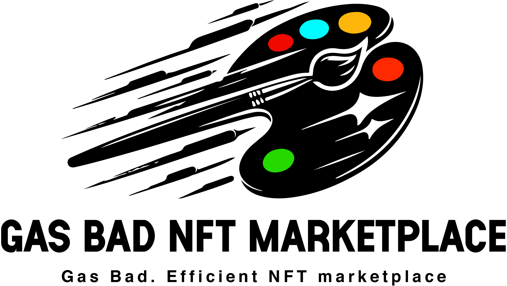

# Gas Bad NFT Marketplace 

<p align="center">

<br/>

This project focuses on building a gas-optimized NFT marketplace on the Ethereum mainnet, utilizing assembly and formal verification techniques.

We are building a "gas bad" marketplace. An NFT marketplace, but we are going for a gas optimized version. 

To do this, we are writing 2 types of smart contracts:

1. Reference contracts in solidity 
2. Optimized contracts in solidity / assembly 

We will be deploying `GasBadNftMarketplace.sol` to the Ethereum mainnet, but are using `NftMarketplace.sol` as a reference point. 

<!-- <p align="center">

<br/> -->

# Getting Started

## Quickstart

```
git clone https://github.com/jkn1092/gas-bad-nft-marketplace-audit
cd gas-bad-nft-marketplace-audit
make
```

# Usage

## Certora


### Certora Setup

After installing the [Certora CLI](https://docs.certora.com/en/latest/docs/user-guide/getting-started/install.html), you'll need to set up your environment variables. The instructions here only work for linux/macOs/windows WSL.

```bash
export CERTORAKEY=<personal_access_key>
```

or, you can ruh:

```
source .env.example
```

You can check if the environment variable is set by running:

```bash
echo $CERTORAKEY
```

### Running Certora 

In this repo, we will be heavily relying on Certora to make sure our codebase is good! We have the following specs:
- `GasBadNft.spec`: For formally verifying the `GasBadNftContract.sol`
- `NftMock.spec`: For showcasing some cool Certora functionality 😊 

The two main commands to run the specs, respectively are:

```
make certora
make certoraNft
```

See the `Makefile` for more details.

## Testing

```
forge test
```

### Test Coverage

```
forge coverage
```

and for coverage based testing:

```
forge coverage --report debug
```

# Audit Scope Details

- Commit Hash: 
- In Scope:

```

```

## Compatibilities

- Solc Version: 0.8.20
- Chain(s) to deploy contract to: 
  - Ethereum
